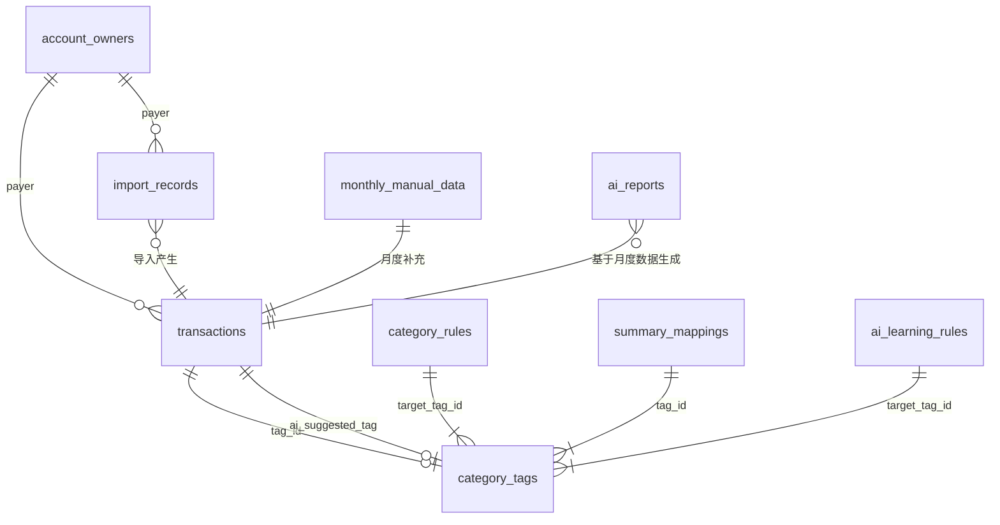
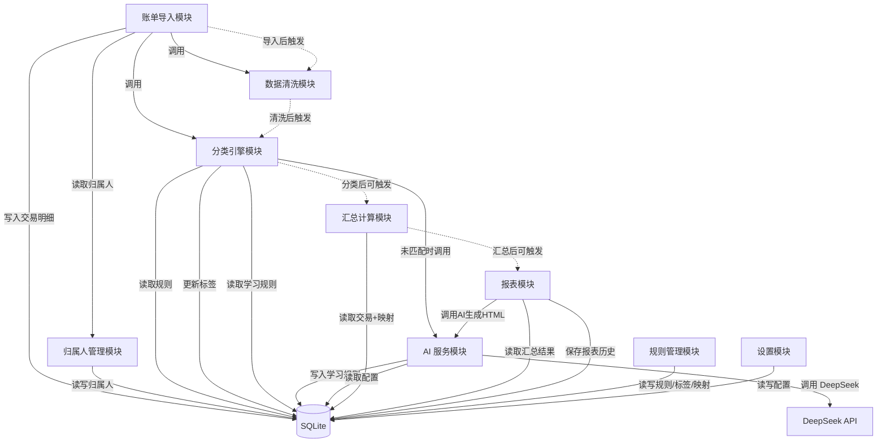
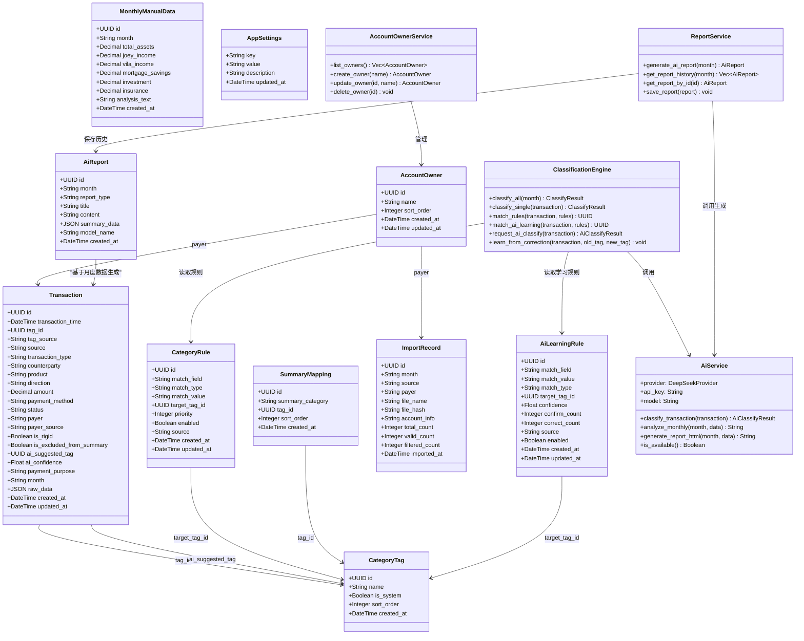
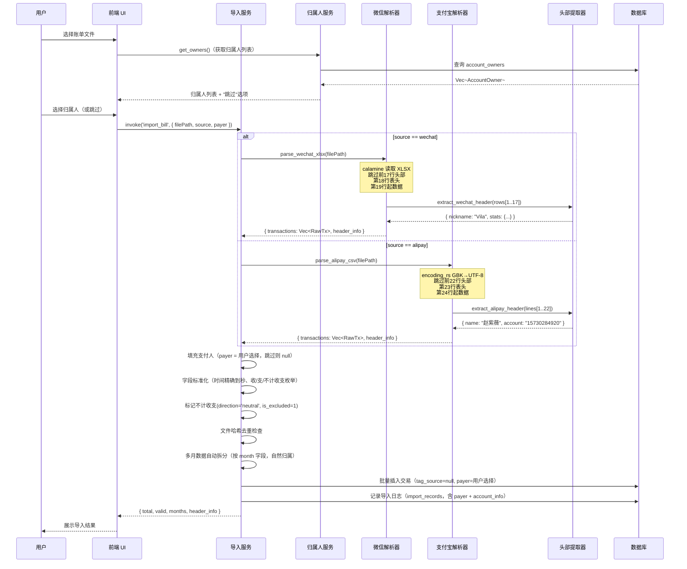
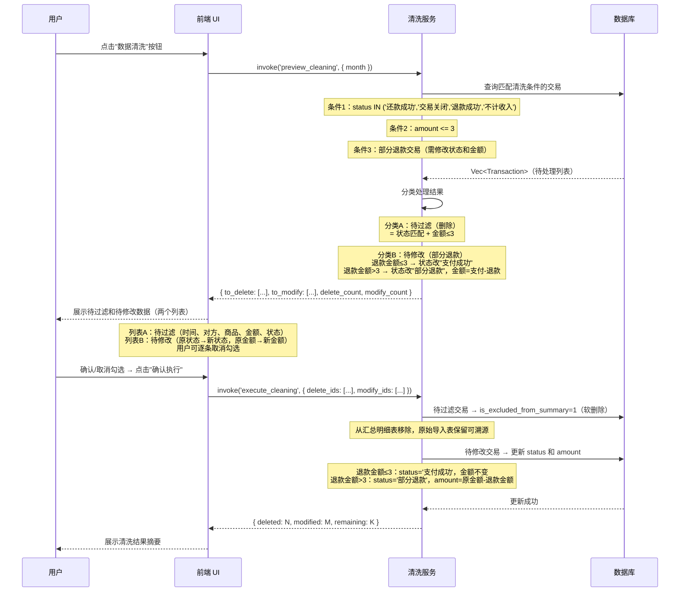
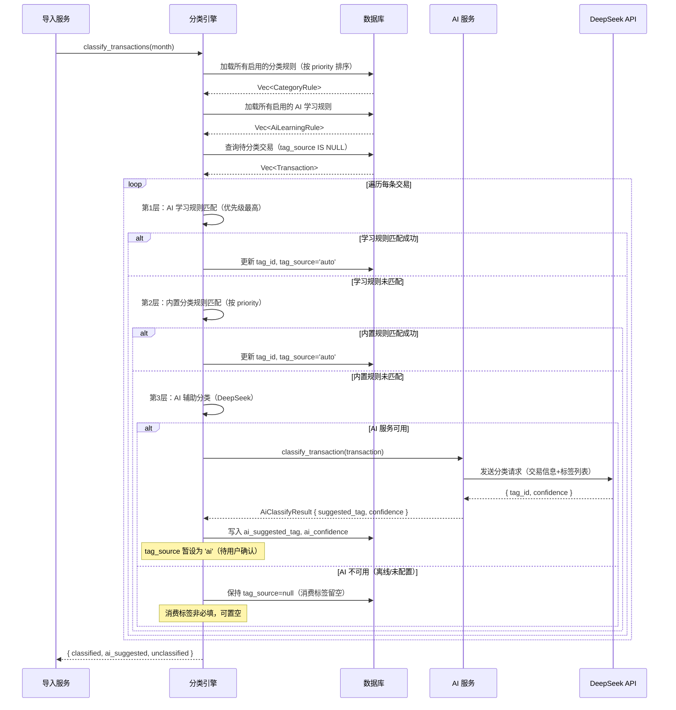
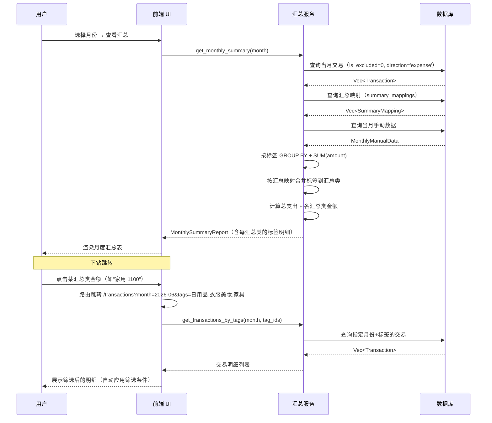
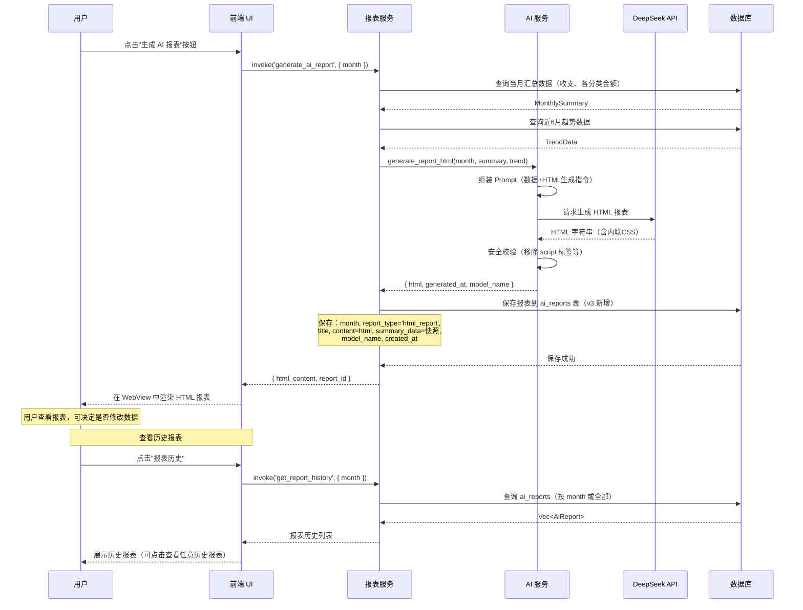
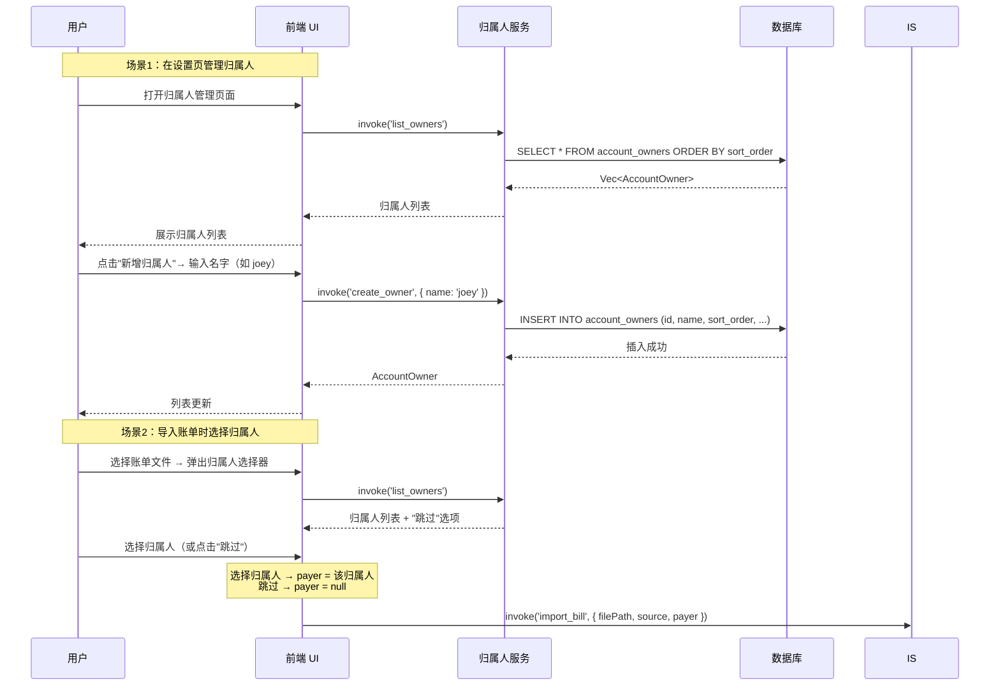
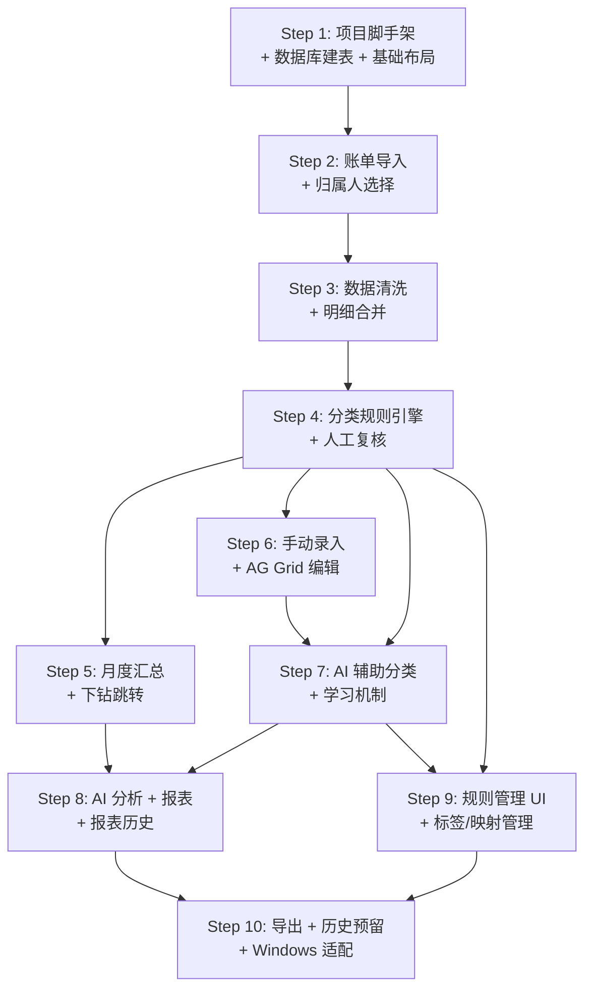

# 家庭记账桌面应用 — 实现方案

> **文档状态**：已确认，可进入开发 | **版本**：v3.0 | **作者**：架构师（高见远）
>
> **v3 变更摘要**：技术栈确认 Tauri 2（不再讨论选项）；AI 服务商确认 DeepSeek；新增归属人联系人管理（account_owners 表）；新增 AI 报表历史保存（ai_reports 表）；数据清洗规则大幅细化（部分退款处理、金额≤3 过滤、不计收入状态）；微信中性交易标注为后续扩展；月份归属确认自然归属；消费标签非必填、荭包命名修正；新增"增量开发计划"章节（10 个开发步骤）；所有已确认决策标注"已确认"。

---

## 目录

1. [技术栈选型](#1-技术栈选型)
2. [数据存储方案](#2-数据存储方案)
3. [系统架构设计](#3-系统架构设计)
4. [文件结构](#4-文件结构)
5. [核心数据结构](#5-核心数据结构)
6. [核心流程设计](#6-核心流程设计)
7. [分类规则引擎设计](#7-分类规则引擎设计)
8. [AI 模块设计](#8-ai-模块设计)
9. [Excel 级编辑方案](#9-excel-级编辑方案)
10. [增量开发计划](#10-增量开发计划)
11. [待确认问题状态](#11-待确认问题状态)
12. [待明确事项](#12-待明确事项)

---

## 1. 技术栈选型

> **v3 确认**：技术栈已确认为 **Tauri 2 + React + TypeScript**，不再讨论其他选项。本节仅保留最终确认的技术栈清单和设计理由，供开发参考。

### 1.1 确认方案：Tauri 2 + React + TypeScript

**选择 Tauri 2 的核心理由**：

1. **跨平台复用性极高**：Rust 后端代码天然跨平台编译，前端 React 代码 100% 复用。从 macOS 迁移到 Windows，预计仅需 1-2 天适配（文件路径规范、WebView2 依赖检测、图标资源替换），核心业务逻辑零修改。

2. **安装包体积极小**：家庭记账是"每月用一次"的工具型应用，~15MB 的安装包对用户体验友好。后续 Windows 版本分发时小包体更友好。

3. **性能优势明显**：Rust 后端处理 XLSX 解析（calamine）、GBK CSV 解码（encoding_rs）、SQLite 操作（rusqlite）均高效。用户每月账单可能数百条，加上 8 年历史数据导入（数万条），Rust 性能余量充足。

4. **XLSX + GBK CSV 双格式原生支持**：
   - 微信账单是 **XLSX 格式**，Rust 的 `calamine` crate 是成熟的高性能 Excel 读取库，直接解析工作表、跳过头部行、提取 datetime 类型交易时间。
   - 支付宝账单是 **CSV + GBK 编码**，Rust 的 `encoding_rs` 精确处理 GBK→UTF-8 转码，`csv` crate 处理 CSV 结构化解析。

5. **AI 调用稳定**：Rust 的 `reqwest` 是成熟的异步 HTTP 客户端，支持 TLS、超时、重试，调用 DeepSeek API 稳定可靠。

6. **React 生态完整复用**：前端完全使用 React + TypeScript + MUI + AG Grid，生态成熟。

### 1.2 技术栈清单（v3 确认）

| 层 | 技术 | 版本 | 用途 |
|----|------|------|------|
| **桌面框架** | Tauri | 2.x | 应用外壳、Rust 后端、文件系统访问、跨平台编译 |
| **前端框架** | React | 18.x | UI 组件化开发 |
| **类型系统** | TypeScript | 5.x | 类型安全 |
| **构建工具** | Vite | 5.x | 前端构建与热更新 |
| **UI 组件库** | MUI (Material-UI) | 5.x | 表单、对话框、导航等基础组件 |
| **CSS 方案** | Tailwind CSS | 3.x | 原子化样式，快速布局 |
| **数据表格** | AG Grid Community | 32.x | Excel 级编辑体验（行内编辑、键盘导航、复制粘贴、虚拟滚动） |
| **图表库** | Recharts | 2.x | 月度报表、趋势图表 |
| **状态管理** | Zustand | 4.x | 轻量全局状态管理 |
| **路由** | React Router | 6.x | 页面路由 + 带参跳转（汇总下钻） |
| **后端语言** | Rust | 1.75+ | XLSX/CSV 解析、数据库、分类引擎、AI 调用 |
| **数据库** | SQLite (rusqlite) | - | 本地数据持久化 |
| **XLSX 解析** | calamine | 0.25+ | 微信账单 XLSX 文件读取 |
| **编码转换** | encoding_rs | 0.8+ | 支付宝账单 GBK→UTF-8 解码 |
| **CSV 解析** | csv | 1.3+ | 支付宝账单 CSV 结构化解析 |
| **HTTP 客户端** | reqwest | 0.12+ | 调用 DeepSeek API |
| **序列化** | serde / serde_json | - | Rust 数据序列化 |
| **加密** | aes-gcm | 0.10+ | API Key 本地加密存储 |

### 1.3 v3 技术栈变更说明

| 变更项 | v2 | v3 | 原因 |
|--------|----|----|------|
| AI 服务商 | 多服务商支持（OpenAI/Claude/通义/文心） | **确认 DeepSeek** | 用户确认使用 DeepSeek，API Key 用户自行提供 |
| 技术栈讨论 | 含 Tauri vs Electron 对比表 | **删除对比，确认 Tauri 2** | 用户已确认，不再讨论 |

---

## 2. 数据存储方案

### 2.1 方案确认：SQLite

延续 v1/v2 决策，SQLite 是最佳选择。家庭记账数据高度结构化，需要频繁 GROUP BY + SUM 聚合计算，SQLite 原生支持 SQL 查询。单文件数据库备份方便，8 年数据量（约 3-4 万条交易）对 SQLite 毫无压力。

### 2.2 数据库文件位置

```
macOS:   ~/Library/Application Support/family-accounting-app/database.db
Windows: %APPDATA%/family-accounting-app/database.db  （未来 Windows 版本）
```

### 2.3 核心数据表设计（v3 更新）

> **v3 新增表**：`account_owners`（归属人管理）、`ai_reports`（AI 报表历史）。

#### 表 1：transactions（交易明细表）— v3 更新

> 存储从微信/支付宝导入并清洗后的交易记录。v3 变更：`tag_id` 明确标注可空（消费标签非必填）；清洗逻辑新增 `cleaning_status` 字段标记部分退款修改。

| 字段名 | 类型 | 说明 | 示例 |
|--------|------|------|------|
| id | TEXT (UUID) | 主键 | `a1b2c3d4-...` |
| transaction_time | TEXT | 交易时间（ISO 8601，精确到秒） | `2026-06-30T16:51:40` |
| tag_id | TEXT | 消费标签 ID（外键 → category_tags.id），**NULL 表示未分类（消费标签非必填）** | `tag_canyin` |
| tag_source | TEXT | 分类来源：`auto`（规则匹配）/ `ai`（AI 建议）/ `manual`（人工指定）/ `null`（未分类） | `auto` |
| source | TEXT | 数据来源：`wechat` / `alipay` / `manual` | `wechat` |
| transaction_type | TEXT | 交易类型（来自账单原始字段） | `日用百货` |
| counterparty | TEXT | 交易对方 | `蜜雪冰城` |
| product | TEXT | 商品名称 | `蜜雪冰城` |
| direction | TEXT | 收/支：`income` / `expense` / `neutral`（不计收支） | `expense` |
| amount | REAL | 金额（元） | `4.5` |
| payment_method | TEXT | 支付方式 | `中国银行储蓄卡(1895)` |
| status | TEXT | 交易状态 | `支付成功` |
| payer | TEXT | 支付人（外键 → account_owners.name），**NULL 表示未指定**（导入时跳过归属人则空） | `joey` |
| payer_source | TEXT | 支付人来源：`auto`（账单来源自动判定）/ `manual`（手动修改） | `auto` |
| is_rigid | INTEGER | 是否刚需：1=是 / 0=否 / NULL=未设置 | `1` |
| is_excluded_from_summary | INTEGER | 是否排除出汇总（不计收支/清洗过滤/特殊标记删除）：1=是 / 0=否 | `0` |
| ai_suggested_tag | TEXT | AI 建议的标签 ID（外键 → category_tags.id），NULL 表示无 AI 建议 | `tag_canyin` |
| ai_confidence | REAL | AI 置信度（0.0-1.0），NULL 表示无 AI 建议 | `0.85` |
| payment_purpose | TEXT | 支付用途（预留字段，暂不使用） | `null` |
| month | TEXT | 所属月份（YYYY-MM，自然归属，无需特殊处理） | `2026-06` |
| raw_data | TEXT | 原始账单 JSON（保留完整原始记录，用于溯源） | `{...}` |
| created_at | TEXT | 创建时间 | `2026-07-01T10:00:00` |
| updated_at | TEXT | 更新时间 | `2026-07-01T10:00:00` |

**v3 字段变更说明**：
- `tag_id` 明确标注 **可空**：消费标签非必填字段，无法分类的交易 tag_id 为 NULL，不影响其他流程。
- `payer` 关联到 `account_owners` 表：归属人通过 APP 内联系人管理维护，导入时选择。
- `month` 月份归属规则确认：**自然归属**，过了当天 23:59:59 都算第二天，月份同理。即 7月1日 00:00:00 的交易算 7 月，6月30日 23:59:59 的交易算 6 月。无需特殊处理逻辑，直接取 `transaction_time` 的年月。

**索引**：
- `idx_transactions_month` ON (month)
- `idx_transactions_tag` ON (tag_id)
- `idx_transactions_payer` ON (payer)
- `idx_transactions_time` ON (transaction_time)
- `idx_transactions_direction` ON (direction)
- `idx_transactions_excluded` ON (is_excluded_from_summary)
- `idx_transactions_status` ON (status)

#### 表 2：account_owners（归属人表）— v3 新增

> 像买票系统添加联系人一样，用户在 APP 中添加归属人。只保存名字（如 joey、vila），不需要其他信息。每次上传账单时选择是哪个归属人的账单，支持跳过（跳过则支付人字段为空）。

| 字段名 | 类型 | 说明 | 示例 |
|--------|------|------|------|
| id | TEXT (UUID) | 主键 | `owner_001` |
| name | TEXT | 归属人名称（唯一，用户自定义） | `joey` |
| sort_order | INTEGER | 排序序号 | `1` |
| created_at | TEXT | 创建时间 | `2026-07-01T10:00:00` |
| updated_at | TEXT | 更新时间 | `2026-07-01T10:00:00` |

**设计说明**：
- 归属人管理类似"购票系统添加联系人"——用户只需输入名字，不需要手机号、身份证等其他信息。
- 导入账单时弹出归属人选择器（下拉列表 + "跳过"选项），选择后该批次账单的所有交易 `payer` 自动填充为该归属人。
- 选择"跳过"则该批次交易的 `payer` 字段为空（NULL）。
- 支持随时新增归属人（导入时如果没有所需归属人，可直接在导入弹窗中新增）。
- `monthly_manual_data` 表的 `joey_income` 和 `vila_income` 字段在 v3 中保持不变（这两个是历史固定的手动数据字段，不与 account_owners 做强关联，避免增加复杂度）。

#### 表 3：category_rules（分类规则表）— 无变化

| 字段名 | 类型 | 说明 | 示例 |
|--------|------|------|------|
| id | TEXT (UUID) | 主键 | `rule_001` |
| match_field | TEXT | 匹配字段：`counterparty` / `product` / `transaction_type` | `counterparty` |
| match_type | TEXT | 匹配方式：`exact`（等于）/ `like`（包含）/ `in`（在列表中） | `exact` |
| match_value | TEXT | 匹配值。`in` 类型时为逗号分隔的多个值 | `房东-Lyp 刘苑平 3169` |
| target_tag_id | TEXT | 目标标签 ID（外键 → category_tags.id） | `tag_fangzu` |
| priority | INTEGER | 优先级（数字越小越优先） | `100` |
| enabled | INTEGER | 是否启用：1=是 / 0=否 | `1` |
| source | TEXT | 规则来源：`builtin`（内置迁移）/ `user`（用户手动创建）/ `ai_learned`（AI 学习生成） | `builtin` |
| created_at | TEXT | 创建时间 | `2026-07-01T10:00:00` |
| updated_at | TEXT | 更新时间 | `2026-07-01T10:00:00` |

**索引**：
- `idx_rules_enabled` ON (enabled)
- `idx_rules_priority` ON (priority)
- `idx_rules_source` ON (source)

#### 表 4：category_tags（消费标签表）— 无变化

| 字段名 | 类型 | 说明 | 示例 |
|--------|------|------|------|
| id | TEXT (UUID) | 主键 | `tag_fangzu` |
| name | TEXT | 标签名称（唯一） | `房租` |
| is_system | INTEGER | 是否系统内置：1=是（不可删除）/ 0=否 | `1` |
| sort_order | INTEGER | 排序序号 | `1` |
| created_at | TEXT | 创建时间 | `2026-07-01T10:00:00` |
| updated_at | TEXT | 更新时间 | `2026-07-01T10:00:00` |

**初始标签枚举**（共 24 个，v3 确认用"荭包"而非"红包"）：
房租、买菜、餐饮、大餐、水果、衣服美妆、零食饮料、话费、交通、日用品、医疗药品、九九、会员、运动、其他、**荭包**、家具、游玩、旅游、学习、礼物、给我的宝、车子、烘焙

#### 表 5：summary_mappings（汇总类映射表）— 无变化

| 字段名 | 类型 | 说明 | 示例 |
|--------|------|------|------|
| id | TEXT (UUID) | 主键 | `map_001` |
| summary_category | TEXT | 汇总类名称 | `买菜` |
| tag_id | TEXT | 标签 ID（外键 → category_tags.id） | `tag_maicai` |
| sort_order | INTEGER | 汇总类排序 | `2` |
| created_at | TEXT | 创建时间 | `2026-07-01T10:00:00` |

**汇总映射配置**：

| 汇总类 | 包含标签 |
|--------|---------|
| 房租 | 房租 |
| 买菜 | 买菜、水果 |
| 餐饮 | 餐饮 |
| 交通 | 交通 |
| 家用 | 日用品、衣服美妆、家具 |
| 话费 | 话费 |
| 玩的开心 | 游玩、旅游 |
| 零食饮料 | 零食饮料 |
| 学习运动 | 学习、运动 |
| 九九 | 九九 |
| 大餐 | 大餐、烘焙 |
| 荭包礼物 | 荭包、礼物、给我的宝 |
| 医疗药品 | 医疗药品 |
| 其他 | 其他 |
| 会员 | 会员 |
| 车子 | 车子 |

#### 表 6：monthly_manual_data（月度手动数据表）— 无变化

| 字段名 | 类型 | 说明 | 示例 |
|--------|------|------|------|
| id | TEXT (UUID) | 主键 | `mmd_202606` |
| month | TEXT | 月份（YYYY-MM，唯一） | `2026-06` |
| total_assets | REAL | 总资产 | `889882` |
| joey_income | REAL | Joey 收入 | `10000` |
| vila_income | REAL | Vila 收入 | `10000` |
| mortgage_savings | REAL | 房贷/存钱 | `10000` |
| investment | REAL | 理财 | `10000` |
| insurance | REAL | 保险 | `11000` |
| analysis_text | TEXT | 分析（文字描述） | `买了1w的金条和1w1的保险` |
| created_at | TEXT | 创建时间 | `2026-07-01T10:00:00` |
| updated_at | TEXT | 更新时间 | `2026-07-01T10:00:00` |

#### 表 7：import_records（导入记录表）— 无变化

| 字段名 | 类型 | 说明 | 示例 |
|--------|------|------|------|
| id | TEXT (UUID) | 主键 | `imp_001` |
| month | TEXT | 导入的账单月份 | `2026-06` |
| source | TEXT | 账单来源：`wechat` / `alipay` | `wechat` |
| payer | TEXT | 导入时选择的归属人（外键 → account_owners.name），NULL 表示跳过 | `vila` |
| file_name | TEXT | 原始文件名 | `vila微信支付账单流水文件(20260601-20260630).xlsx` |
| file_hash | TEXT | 文件内容哈希（用于去重） | `sha256:abc123...` |
| account_info | TEXT | 从头部提取的账户信息（微信昵称/支付宝账户+姓名） | `Vila` |
| total_count | INTEGER | 导入总条数 | `103` |
| valid_count | INTEGER | 有效条数（过滤后） | `94` |
| filtered_count | INTEGER | 过滤条数 | `9` |
| imported_at | TEXT | 导入时间 | `2026-07-01T10:00:00` |

#### 表 8：ai_learning_rules（AI 学习规则表）— 无变化

| 字段名 | 类型 | 说明 | 示例 |
|--------|------|------|------|
| id | TEXT (UUID) | 主键 | `ail_001` |
| match_field | TEXT | 匹配字段：`counterparty` / `product` / `transaction_type` | `counterparty` |
| match_value | TEXT | 匹配值（从交易中提取的特征值） | `某商家名称` |
| match_type | TEXT | 匹配方式：`exact` / `like` / `in` | `exact` |
| target_tag_id | TEXT | 目标标签 ID（外键 → category_tags.id） | `tag_canyin` |
| confidence | REAL | 置信度（基于确认次数/总次数计算） | `0.95` |
| confirm_count | INTEGER | 用户确认次数 | `5` |
| correct_count | INTEGER | 用户修正次数（修正为其他标签） | `0` |
| source | TEXT | 来源：`ai_confirmed` / `ai_corrected` / `manual` | `ai_confirmed` |
| enabled | INTEGER | 是否启用：1=是 / 0=否 | `1` |
| created_at | TEXT | 创建时间 | `2026-07-01T10:00:00` |
| updated_at | TEXT | 更新时间 | `2026-07-01T10:00:00` |

**索引**：
- `idx_ai_rules_field_value` ON (match_field, match_value)
- `idx_ai_rules_enabled` ON (enabled)

#### 表 9：ai_reports（AI 报表历史表）— v3 新增

> AI 生成的报表保存到数据库历史中，用户可随时查阅历史报告。每次生成 AI 报表时，将 HTML 内容、分析文本等保存到此表。

| 字段名 | 类型 | 说明 | 示例 |
|--------|------|------|------|
| id | TEXT (UUID) | 主键 | `rpt_001` |
| month | TEXT | 报表所属月份（YYYY-MM） | `2026-06` |
| report_type | TEXT | 报表类型：`html_report`（AI HTML 报表）/ `analysis`（AI 月度分析文本） | `html_report` |
| title | TEXT | 报表标题 | `2026年6月家庭收支报表` |
| content | TEXT | 报表内容（HTML 报表为 HTML 字符串；分析报告为文本） | `<html>...</html>` |
| summary_data | TEXT | 生成时的汇总数据快照（JSON，用于复现） | `{"total_expense": 5000, ...}` |
| model_name | TEXT | 生成报表使用的 AI 模型名称 | `deepseek-chat` |
| created_at | TEXT | 生成时间 | `2026-07-01T10:00:00` |

**设计说明**：
- 每次用户点击"生成 AI 报表"或"AI 分析"，生成的内容保存到此表。
- 同一月份可以有多份报表（如用户修改数据后重新生成），通过 `created_at` 区分。
- 用户可在"报表历史"页面查看所有历史报告，按月份或时间排序。
- `summary_data` 保存生成时的数据快照，方便用户对比不同时期的报表。
- `report_type` 区分 HTML 报表和文本分析，两种类型分别存储。

**索引**：
- `idx_ai_reports_month` ON (month)
- `idx_ai_reports_type` ON (report_type)
- `idx_ai_reports_created` ON (created_at)

#### 表 10：app_settings（应用设置表）— v3 更新预置项

| 字段名 | 类型 | 说明 | 示例 |
|--------|------|------|------|
| key | TEXT | 配置键名（主键） | `ai_api_key` |
| value | TEXT | 配置值（API Key 等敏感信息加密存储） | `enc:aes256:...` |
| description | TEXT | 配置说明 | `DeepSeek API Key` |
| updated_at | TEXT | 更新时间 | `2026-07-01T10:00:00` |

**v3 预置配置项**（确认 DeepSeek）：

| key | 说明 | 加密 |
|-----|------|------|
| `ai_provider` | AI 服务商：**固定 `deepseek`** | 否 |
| `ai_api_key` | DeepSeek API Key（用户自行配置） | **是**（AES-256-GCM 加密） |
| `ai_model` | 模型名称（如 `deepseek-chat`） | 否 |
| `ai_base_url` | DeepSeek API 地址（默认 `https://api.deepseek.com`） | 否 |
| `ai_enabled` | 是否启用 AI 功能：`true` / `false` | 否 |

### 2.4 表关系总览（v3 更新）



---

## 3. 系统架构设计

### 3.1 整体架构分层（v3 更新）

```
┌─────────────────────────────────────────────────────────────────┐
│                    UI 层 (React + MUI + AG Grid)                  │
│  ┌──────────┐ ┌──────────┐ ┌──────────┐ ┌──────────┐ ┌───────┐ │
│  │ 导入页面  │ │ 明细页面  │ │ 汇总页面  │ │ 规则管理  │ │设置页 │ │
│  │(选归属人)│ │(AG Grid) │ │ (下钻跳转)│ │          │ │(AI配置)│ │
│  └──────────┘ └──────────┘ └──────────┘ └──────────┘ └───────┘ │
│  ┌──────────┐ ┌──────────┐ ┌──────────┐                         │
│  │清洗确认页 │ │AI报表页面 │ │报表历史页 │                         │
│  └──────────┘ └──────────┘ └──────────┘                         │
├─────────────────────────────────────────────────────────────────┤
│                    Tauri IPC 通信层                               │
│                (前端 invoke ←→ 后端 command)                      │
├─────────────────────────────────────────────────────────────────┤
│                  业务逻辑层 (Rust Services)                       │
│  ┌──────────┐ ┌──────────┐ ┌──────────┐ ┌──────────┐           │
│  │ 账单导入  │ │ 分类引擎  │ │ 汇总计算  │ │ 规则管理  │           │
│  │ 模块     │ │ 模块     │ │ 模块     │ │ 模块     │           │
│  └──────────┘ └──────────┘ └──────────┘ └──────────┘           │
│  ┌──────────┐ ┌──────────┐ ┌──────────┐ ┌──────────┐           │
│  │ 报表模块  │ │ AI 服务   │ │ 数据清洗  │ │归属人管理 │           │
│  │(含历史)  │ │(DeepSeek)│ │ 模块     │ │ 模块     │           │
│  └──────────┘ └──────────┘ └──────────┘ └──────────┘           │
├─────────────────────────────────────────────────────────────────┤
│                    数据访问层 (Rust DAO)                          │
│              ┌──────────────────────────┐                        │
│              │     SQLite (rusqlite)     │                        │
│              └──────────────────────────┘                        │
├─────────────────────────────────────────────────────────────────┤
│                    外部服务层                                     │
│         ┌──────────────────────┐                                 │
│         │  DeepSeek API (reqwest)│                                 │
│         └──────────────────────┘                                 │
└─────────────────────────────────────────────────────────────────┘
```

### 3.2 核心模块说明（v3 更新）

| 模块 | 职责 | v3 变更 |
|------|------|---------|
| **账单导入模块** | 解析微信 XLSX / 支付宝 CSV(GBK) 账单 | 归属人选择改为从 account_owners 表读取，支持跳过 |
| **分类引擎模块** | 规则匹配 + AI 辅助分类 + 学习机制 | 消费标签可空，未分类不影响流程 |
| **汇总计算模块** | 按月份+标签汇总支出，支持下钻跳转 | 月份自然归属，无需特殊处理 |
| **报表模块** | 生成可视化报表 + AI HTML 报表 + **报表历史保存** | v3 新增：AI 报表保存到 ai_reports 表，支持历史查阅 |
| **规则管理模块** | 管理分类规则/标签/映射 | 无变化 |
| **AI 服务模块** | **DeepSeek 调用**（分类辅助/月度分析/报表生成） | v3 变更：确认 DeepSeek，实现 DeepSeek 适配 |
| **数据清洗模块** | 按钮触发 → 列出待过滤/待修改 → 用户确认 → 执行 | v3 大幅细化：部分退款处理、金额≤3过滤、不计收入状态 |
| **归属人管理模块** | 归属人的增删改查（像买票系统添加联系人） | **v3 全新模块** |
| **设置模块** | AI API Key 配置（DeepSeek）、加解密 | v3 确认 DeepSeek |

### 3.3 模块间依赖关系（v3 更新）



### 3.4 前后端通信机制

Tauri 通过 **IPC (Inter-Process Communication)** 连接前端和后端：

- **前端 → 后端**：React 通过 `@tauri-apps/api` 的 `invoke()` 调用 Rust 定义的 `#[tauri::command]` 函数。
- **后端 → 前端**：Rust 通过 `app_handle.emit()` 发送事件，React 通过 `listen()` 监听（用于导入进度、AI 分析进度等异步通知）。

**通信约定**：

```
前端调用示例：
invoke('import_bill', { filePath: '/path/to/wechat.xlsx', source: 'wechat', payer: 'vila' })

后端响应格式（统一）：
{
  "success": true,
  "data": { ... },
  "message": "导入成功，共 94 条有效记录"
}
```

---

## 4. 文件结构

```
family-accounting-app/
│
├── package.json                          # 前端依赖声明
├── tsconfig.json                         # TypeScript 配置
├── vite.config.ts                        # Vite 构建配置
├── tailwind.config.ts                    # Tailwind CSS 配置
├── index.html                            # 前端入口 HTML
├── README.md
│
├── docs/                                 # 文档目录
│   ├── PRD.md                            # 产品需求文档 v2
│   ├── 使用步骤.md                        # 用户 Excel 操作步骤
│   ├── 实现方案.md                        # 本文档
│   ├── class-diagram.mermaid             # 类图
│   └── sequence-diagram.mermaid          # 时序图
│
├── src-tauri/                            # ===== Rust 后端 =====
│   ├── Cargo.toml                        # Rust 依赖声明
│   ├── tauri.conf.json                   # Tauri 应用配置
│   ├── build.rs
│   │
│   ├── src/
│   │   ├── main.rs                       # 应用入口
│   │   ├── lib.rs                        # 模块注册
│   │   │
│   │   ├── db/                           # 数据访问层
│   │   │   ├── mod.rs
│   │   │   ├── connection.rs             # SQLite 连接管理
│   │   │   ├── schema.rs                 # 建表 SQL 定义（含 v3 新表）
│   │   │   ├── migrations.rs             # 数据库迁移
│   │   │   └── dao/
│   │   │       ├── transaction_dao.rs    # 交易明细 DAO
│   │   │       ├── rule_dao.rs           # 分类规则 DAO
│   │   │       ├── tag_dao.rs            # 消费标签 DAO
│   │   │       ├── mapping_dao.rs        # 汇总映射 DAO
│   │   │       ├── manual_data_dao.rs    # 手动数据 DAO
│   │   │       ├── import_dao.rs         # 导入记录 DAO
│   │   │       ├── ai_learning_dao.rs    # AI 学习规则 DAO
│   │   │       ├── ai_report_dao.rs      # AI 报表历史 DAO（v3 新增）
│   │   │       ├── account_owner_dao.rs  # 归属人 DAO（v3 新增）
│   │   │       └── settings_dao.rs       # 应用设置 DAO
│   │   │
│   │   ├── models/                       # 数据模型
│   │   │   ├── mod.rs
│   │   │   ├── transaction.rs            # 交易明细模型
│   │   │   ├── category_rule.rs          # 分类规则模型
│   │   │   ├── category_tag.rs           # 消费标签模型
│   │   │   ├── summary_mapping.rs        # 汇总映射模型
│   │   │   ├── monthly_manual_data.rs    # 月度手动数据模型
│   │   │   ├── import_record.rs          # 导入记录模型
│   │   │   ├── ai_learning_rule.rs       # AI 学习规则模型
│   │   │   ├── ai_report.rs              # AI 报表模型（v3 新增）
│   │   │   ├── account_owner.rs          # 归属人模型（v3 新增）
│   │   │   └── app_settings.rs           # 应用设置模型
│   │   │
│   │   ├── services/                     # 业务逻辑层
│   │   │   ├── mod.rs
│   │   │   ├── import_service.rs         # 账单导入服务
│   │   │   ├── classification_engine.rs  # 分类引擎
│   │   │   ├── summary_service.rs        # 汇总计算服务
│   │   │   ├── report_service.rs         # 报表生成服务（v3 更新：含历史保存）
│   │   │   ├── rule_service.rs           # 规则管理服务
│   │   │   ├── cleaning_service.rs       # 数据清洗服务（v3 大幅更新）
│   │   │   ├── ai_service.rs             # AI 服务模块（v3 更新：DeepSeek）
│   │   │   └── account_owner_service.rs  # 归属人管理服务（v3 新增）
│   │   │
│   │   ├── parsers/                      # 账单解析器
│   │   │   ├── mod.rs
│   │   │   ├── wechat_parser.rs          # 微信 XLSX 解析（calamine）
│   │   │   ├── alipay_parser.rs          # 支付宝 CSV-GBK 解析（encoding_rs+csv）
│   │   │   └── bill_header.rs            # 账单头部信息提取（账户/统计）
│   │   │
│   │   ├── ai/                           # AI 模块
│   │   │   ├── mod.rs
│   │   │   ├── provider.rs               # AI 服务商抽象 trait
│   │   │   ├── deepseek_provider.rs      # DeepSeek 实现（v3 确认）
│   │   │   ├── prompts.rs                # Prompt 模板管理
│   │   │   └── cache.rs                  # AI 结果缓存
│   │   │
│   │   └── commands/                     # Tauri 命令（IPC 接口）
│   │       ├── mod.rs
│   │       ├── import_commands.rs        # 导入相关命令
│   │       ├── transaction_commands.rs   # 交易明细命令
│   │       ├── classification_commands.rs# 分类相关命令
│   │       ├── summary_commands.rs       # 汇总相关命令
│   │       ├── report_commands.rs        # 报表相关命令（v3 更新：含历史）
│   │       ├── rule_commands.rs          # 规则管理命令
│   │       ├── cleaning_commands.rs      # 数据清洗命令（v3 大幅更新）
│   │       ├── ai_commands.rs            # AI 相关命令
│   │       ├── account_owner_commands.rs # 归属人管理命令（v3 新增）
│   │       └── settings_commands.rs      # 设置命令
│   │
│   └── migrations/                       # SQL 迁移脚本
│       └── 001_init.sql                  # 初始建表（含 v3 新表）
│
├── src/                                  # ===== React 前端 =====
│   ├── main.tsx                          # React 入口
│   ├── App.tsx                           # 根组件 + 路由
│   │
│   ├── types/                            # TypeScript 类型定义
│   │   ├── index.ts                      # 统一导出
│   │   ├── transaction.ts                # 交易明细类型
│   │   ├── rule.ts                       # 分类规则类型
│   │   ├── summary.ts                    # 汇总报表类型
│   │   ├── ai.ts                         # AI 相关类型
│   │   ├── settings.ts                   # 设置类型
│   │   ├── account_owner.ts              # 归属人类型（v3 新增）
│   │   └── api.ts                        # API 响应类型
│   │
│   ├── api/                              # 后端 API 封装
│   │   ├── client.ts                     # Tauri invoke 封装
│   │   ├── import.ts                     # 导入 API
│   │   ├── transaction.ts                # 交易明细 API
│   │   ├── classification.ts             # 分类 API
│   │   ├── summary.ts                    # 汇总 API
│   │   ├── report.ts                     # 报表 API（v3 更新：含历史查阅）
│   │   ├── rule.ts                       # 规则管理 API
│   │   ├── cleaning.ts                   # 数据清洗 API
│   │   ├── ai.ts                         # AI API
│   │   ├── account_owner.ts              # 归属人 API（v3 新增）
│   │   └── settings.ts                   # 设置 API
│   │
│   ├── store/                            # 全局状态管理 (Zustand)
│   │   ├── index.ts
│   │   ├── importStore.ts                # 导入状态
│   │   ├── transactionStore.ts           # 交易明细状态
│   │   ├── summaryStore.ts               # 汇总状态
│   │   ├── ruleStore.ts                  # 规则状态
│   │   ├── accountOwnerStore.ts          # 归属人状态（v3 新增）
│   │   └── settingsStore.ts              # 设置状态
│   │
│   ├── components/                       # UI 组件
│   │   ├── common/                       # 通用组件
│   │   │   ├── Layout.tsx                # 整体布局（侧边栏+主区域）
│   │   │   ├── Sidebar.tsx               # 侧边导航
│   │   │   ├── FileUpload.tsx            # 文件上传组件
│   │   │   ├── PayerSelector.tsx         # 归属人选择器（v3 更新：从 account_owners 读取）
│   │   │   ├── MonthSelector.tsx         # 月份选择器
│   │   │   └── EmptyState.tsx            # 空状态占位
│   │   │
│   │   ├── import/                       # 导入相关组件
│   │   │   ├── ImportPanel.tsx           # 导入操作面板
│   │   │   ├── ImportResult.tsx          # 导入结果展示
│   │   │   └── AccountInfoPreview.tsx    # 账户信息预览
│   │   │
│   │   ├── cleaning/                     # 数据清洗组件
│   │   │   ├── CleaningPanel.tsx         # 清洗操作面板（按钮+确认）
│   │   │   └── CleaningConfirmDialog.tsx # 待过滤/待修改数据确认对话框（v3 大幅更新）
│   │   │
│   │   ├── transactions/                 # 交易明细组件
│   │   │   ├── EditableTransactionTable.tsx # AG Grid 可编辑表格
│   │   │   ├── TransactionTable.tsx      # 只读明细表格（含筛选/排序）
│   │   │   ├── TransactionReview.tsx     # 未匹配交易复核
│   │   │   ├── TagEditor.tsx             # 标签编辑（内联修改）
│   │   │   └── ManualEntryForm.tsx       # 手动数据录入表单
│   │   │
│   │   ├── rules/                        # 规则管理组件
│   │   │   ├── RuleList.tsx              # 规则列表
│   │   │   ├── RuleEditor.tsx            # 规则编辑表单（exact/like/in）
│   │   │   ├── TagManager.tsx            # 标签管理
│   │   │   └── MappingManager.tsx        # 汇总映射管理
│   │   │
│   │   ├── reports/                      # 报表组件
│   │   │   ├── MonthlyReport.tsx         # 月度收支汇总报表
│   │   │   ├── ComparisonReport.tsx      # 多月对比报表
│   │   │   ├── TrendChart.tsx            # 趋势图表
│   │   │   ├── CategoryBreakdown.tsx     # 分类占比饼图
│   │   │   ├── AiReportViewer.tsx        # AI HTML 报表查看器
│   │   │   └── ReportHistory.tsx         # 报表历史列表（v3 新增）
│   │   │
│   │   ├── ai/                           # AI 组件
│   │   │   ├── AiAnalysisButton.tsx      # AI 分析按钮
│   │   │   ├── AiAnalysisResult.tsx      # AI 分析结果展示
│   │   │   └── AiClassificationConfirm.tsx # AI 分类建议确认
│   │   │
│   │   ├── account_owners/               # 归属人管理组件（v3 新增）
│   │   │   ├── OwnerList.tsx             # 归属人列表
│   │   │   ├── OwnerEditor.tsx           # 归属人新增/编辑
│   │   │   └── OwnerSelector.tsx         # 归属人选择器（导入时使用）
│   │   │
│   │   └── settings/                     # 设置组件
│   │       ├── SettingsPanel.tsx          # 设置面板
│   │       ├── AiConfigForm.tsx           # AI 配置表单（DeepSeek API Key）
│   │       └── HistoryImportButton.tsx   # 历史数据导入预留按钮
│   │
│   ├── pages/                            # 页面组件
│   │   ├── ImportPage.tsx                # 导入页面
│   │   ├── TransactionsPage.tsx          # 交易明细页面
│   │   ├── ReviewPage.tsx                # 人工复核页面
│   │   ├── SummaryPage.tsx               # 月度汇总页面
│   │   ├── ReportsPage.tsx               # 报表页面（v3 更新：含历史）
│   │   ├── RulesPage.tsx                 # 规则管理页面
│   │   ├── CleaningPage.tsx              # 数据清洗页面
│   │   ├── AccountOwnersPage.tsx         # 归属人管理页面（v3 新增）
│   │   └── SettingsPage.tsx              # 设置页面
│   │
│   ├── utils/                            # 工具函数
│   │   ├── format.ts                     # 格式化（日期/金额）
│   │   ├── constants.ts                  # 常量定义
│   │   ├── navigation.ts                 # 路由跳转工具
│   │   └── helpers.ts                    # 通用辅助函数
│   │
│   └── styles/
│       ├── global.css                    # 全局样式
│       └── ag-grid.css                   # AG Grid 自定义样式
│
└── src-tauri/icons/                      # 应用图标资源
```

### 工程规模概览（v3）

| 部分 | 文件数 | v3 变化 | 说明 |
|------|--------|---------|------|
| Rust 后端 | ~38 个 | +3 | 新增归属人管理、AI 报表历史 DAO/服务 |
| React 前端 | ~55 个 | +5 | 新增归属人管理组件、报表历史组件 |
| 配置文件 | ~6 个 | 不变 | 构建/类型/样式配置 |
| 文档 | ~5 个 | 不变 | 文档文件 |
| **合计** | **~104 个** | **+8** | v3 新增归属人管理 + AI 报表历史 |

---

## 5. 核心数据结构

### 5.1 数据结构总览（类图）



### 5.2 v3 新增数据结构详细说明

#### AccountOwner（归属人）

| 属性 | 类型 | 说明 |
|------|------|------|
| id | UUID | 唯一标识 |
| name | String | 归属人名称（唯一，用户自定义，如 joey、vila） |
| sort_order | Integer | 排序序号 |
| created_at | DateTime | 创建时间 |
| updated_at | DateTime | 更新时间 |

**设计说明**：归属人管理类似"购票系统添加联系人"——只保存名字，不需要其他信息。用户在 APP 中添加归属人后，导入账单时从列表中选择。

#### AiReport（AI 报表历史）

| 属性 | 类型 | 说明 |
|------|------|------|
| id | UUID | 唯一标识 |
| month | String | 报表所属月份（YYYY-MM） |
| report_type | Enum | `html_report`（AI HTML 报表）/ `analysis`（AI 月度分析文本） |
| title | String | 报表标题 |
| content | String | 报表内容（HTML 字符串或分析文本） |
| summary_data | JSON | 生成时的汇总数据快照 |
| model_name | String | 生成使用的 AI 模型名称 |
| created_at | DateTime | 生成时间 |

---

## 6. 核心流程设计

### 6.1 账单导入流程（v3 更新：归属人联系人管理）



**v3 关键设计点**：

1. **归属人联系人管理**：用户在 APP 中像添加联系人一样管理归属人（只保存名字）。导入账单时从归属人列表中选择，支持跳过（跳过则 `payer` 为空）。如果列表中没有所需归属人，可在导入弹窗中直接新增。

2. **微信 XLSX 解析**：使用 Rust `calamine` crate 读取 XLSX 文件。前 17 行为头部信息（含微信昵称），第 18 行为表头，第 19 行起为数据。交易时间在 XLSX 中为 datetime 类型，calamine 直接解析为 Rust `NaiveDateTime`。

3. **支付宝 CSV-GBK 解析**：先用 `encoding_rs` 将 GBK 字节流解码为 UTF-8 字符串，再用 `csv` crate 解析。前 22 行为头部（含姓名+支付宝账户），第 23 行为表头，第 24 行起为数据。CSV 末尾有逗号结尾的空列，解析时需处理。

4. **不计收支处理**：支付宝的"不计收支"类型（余额宝收益发放、充值提现、账户转存等），导入时 `direction='neutral'`，`is_excluded_from_summary=1`，保留数据但不参与收支汇总。

5. **多月导入兼容**：解析后按 `transaction_time` 的月份自动拆分，写入对应 `month` 字段。月份归属为**自然归属**（交易时间的年月即为所属月份），无需特殊处理。

6. **时间精确到秒 + 倒序**：所有交易时间统一为 `YYYY-MM-DDTHH:MM:SS` 格式（ISO 8601，精确到秒）。合并后按时间倒序排列（最新在最前），方便用户查账。

7. **微信中性交易**：⚠️ **本期不处理**，后续再加规则。微信账单头部提到的"中性交易"（充值/提现/理财通购买/零钱通存取/信用卡还款）在收/支字段不单独标注，本期先全部按收/支字段值正常导入，不做特殊识别。标注为 TODO/后续扩展。

### 6.2 数据清洗流程（v3 大幅更新：部分退款处理 + 金额过滤）



**v3 关键设计点（数据清洗规则细化）**：

1. **过滤状态**：以下状态的交易将被过滤（从汇总明细表移除，原始导入表保留可溯源）：
   - 【还款成功】
   - 【交易关闭】
   - 【退款成功】
   - 【不计收入】

2. **过滤小额交易**：金额 ≤ 3 元的交易将被过滤。这是用户在 PRD 中手动添加的规则。

3. **部分退款处理**（v3 核心新增）：
   - **退款金额 ≤ 3 元**：小额退款忽略，将交易状态改为"支付成功"，金额保持不变。
   - **退款金额 > 3 元**：将交易状态改为"部分退款"，金额 = 支付金额 - 退款金额。
   - 部分退款的退款金额从原始账单数据中提取（微信/支付宝账单中的退款记录或备注）。

4. **按钮触发 → 列出 → 确认 → 执行**：
   - 用户点击"数据清洗"按钮后，系统先扫描并列出**两类数据**：
     - **待过滤列表**：将被从汇总移除的交易（状态匹配 + 金额≤3）
     - **待修改列表**：将被修改状态和金额的交易（部分退款）
   - 用户查看后确认，可逐条取消勾选。确认后系统执行过滤和修改。

5. **软删除而非物理删除**：被清洗的交易设置 `is_excluded_from_summary=1`，从汇总明细表排除，但原始数据保留在 transactions 表中（`raw_data` 字段保留完整原始记录），可溯源查看。

### 6.3 自动分类 + AI 辅助流程（v3 更新：DeepSeek）



**v3 关键设计点**：

1. **三层匹配优先级**：
   - **第 1 层：AI 学习规则**（ai_learning_rules）——优先级最高，基于用户历史确认的规则，准确率最高。
   - **第 2 层：内置分类规则**（category_rules）——用户手动创建或从 Excel IFS 迁移的规则。
   - **第 3 层：AI 大模型辅助（DeepSeek）**——对仍未匹配的交易，调用 DeepSeek 判断，结果写入 `ai_suggested_tag` 供用户确认。

2. **消费标签非必填**：无法分类的交易 `tag_id` 为 NULL，`tag_source` 为 NULL，不影响其他流程。用户可在复核页面手动指定标签，或直接置空。

3. **AI 辅助分类的用户确认**：AI 建议的标签不直接生效，而是写入 `ai_suggested_tag` 和 `ai_confidence`，在前端复核页面展示给用户确认。用户确认后 `tag_source='ai'`，用户修正后 `tag_source='manual'`。

4. **学习机制**：用户确认或修正 AI 建议后，系统自动生成 AI 学习规则，后续相同特征的交易直接匹配学习规则，无需再次调用 DeepSeek。

### 6.4 月度汇总流程（含下钻跳转）



**关键设计点**：

1. **下钻跳转实现**：汇总页面每个金额单元格可点击，点击后通过 React Router 带参跳转到明细页面 `/transactions?month=2026-06&tags=日用品,衣服美妆,家具`。明细页面读取 URL 参数，自动应用筛选条件，展示对应子标签的交易明细。

2. **汇总类→子标签映射**：汇总服务返回的数据结构中，每个汇总类包含其对应的所有子标签 ID 列表，前端点击时直接将标签列表作为跳转参数。

3. **不计收支数据排除**：汇总计算时只统计 `direction='expense'` 且 `is_excluded_from_summary=0` 的交易，不计收支类型自动排除。

4. **月份自然归属**：月份归属确认采用自然归属规则——过了当天 23:59:59 都算第二天，月份同理。即 7月1日 00:00:00 的交易算 7 月，6月30日 23:59:59 的交易算 6 月。直接取 `transaction_time` 的年月即可，无需特殊处理逻辑。

### 6.5 AI 报表生成 + 历史保存流程（v3 更新：DeepSeek + 历史保存）



**v3 关键设计点**：

1. **DeepSeek 生成 HTML**：将月度汇总数据和多月趋势数据通过 Prompt 发送给 DeepSeek，要求生成一个独立的 HTML 页面（含内联 CSS，不依赖外部资源）。DeepSeek 返回 HTML 字符串后，进行安全处理（移除 `<script>` 标签等），在应用内 WebView 中渲染展示。

2. **报表历史保存**（v3 新增）：每次生成 AI 报表后，自动保存到 `ai_reports` 表，包含：
   - 报表所属月份
   - 报表类型（HTML 报表 / 分析文本）
   - 报表内容（HTML 字符串或分析文本）
   - 生成时的汇总数据快照（JSON，用于对比）
   - 使用的模型名称
   - 生成时间

3. **历史报表查阅**：用户可在"报表历史"页面查看所有历史报告，按月份或时间排序。支持点击查看任意历史报表的完整内容。

4. **用户可修改**：AI 报表是参考性质的，用户查看后如果发现数据有误，可回到明细页面修改数据，然后重新生成报表（新报表会作为新的历史记录保存）。

### 6.6 归属人管理流程（v3 新增）



**v3 关键设计点**：

1. **像添加联系人一样简单**：归属人管理只需输入名字，不需要手机号、身份证等其他信息。类似购票系统添加联系人的体验。

2. **导入时选择**：每次导入账单时弹出归属人选择器，用户从列表中选择该批次账单属于谁。支持"跳过"（则该批次交易的 `payer` 字段为空）。

3. **支持在导入时新增**：如果归属人列表中没有所需的，可在导入弹窗中直接新增归属人，无需跳转到设置页面。

---

## 7. 分类规则引擎设计

### 7.1 规则数据结构

```rust
// Rust 模型定义
struct CategoryRule {
    id: String,
    match_field: MatchField,      // 匹配字段
    match_type: MatchType,        // 匹配方式
    match_value: String,          // 匹配值
    target_tag_id: String,        // 目标标签
    priority: i32,                // 优先级（越小越先）
    enabled: bool,
    source: RuleSource,           // 规则来源
}

enum MatchField {
    Counterparty,    // 交易对方
    Product,         // 商品
    TransactionType, // 交易类型
}

enum MatchType {
    Exact,           // 等于：完全匹配
    Like,            // 包含：子串匹配
    In,              // 在列表中：值在逗号分隔的多个值中
}

enum RuleSource {
    Builtin,         // 内置迁移（从 Excel IFS 公式迁移）
    User,            // 用户手动创建
    AiLearned,       // AI 学习生成
}
```

### 7.2 匹配方式说明

| 匹配方式 | 说明 | 使用场景 | 示例 |
|---------|------|---------|------|
| `exact` | 精确等于 | 交易对方名称固定的情况 | `counterparty == "中国移动"` → 话费 |
| `like` | 包含子串 | 商家名有分店后缀/变体的情况 | `counterparty like "零食有鸣"` → 零食饮料（匹配所有分店） |
| `in` | 在列表中 | 多个不同名称对应同一标签 | `counterparty in "中国移动,中国联通,广东联通"` → 话费 |

### 7.3 AI 辅助分类 + 学习机制设计

#### 学习机制核心逻辑

```
用户在复核页面处理 AI 建议的交易：

场景 1：用户确认 AI 建议正确
  → tag_source = 'ai', tag_id = ai_suggested_tag
  → 生成/更新 ai_learning_rules：
    match_field = 交易中最有区分度的字段（优先 counterparty）
    match_value = 该字段的值
    match_type = 'exact'
    target_tag_id = ai_suggested_tag
    confirm_count += 1
    confidence = confirm_count / (confirm_count + correct_count)

场景 2：用户修正 AI 建议（改为其他标签）
  → tag_source = 'manual', tag_id = 用户选择的标签
  → 生成/更新 ai_learning_rules：
    match_field = 交易中最有区分度的字段
    match_value = 该字段的值
    match_type = 'exact'
    target_tag_id = 用户选择的标签（修正后的）
    correct_count += 1
    confidence = confirm_count / (confirm_count + correct_count)

场景 3：用户手动分类（无 AI 建议的交易）
  → tag_source = 'manual'
  → 同样生成 ai_learning_rules（source = 'manual'）

场景 4：用户不分类（消费标签留空）
  → tag_id = NULL, tag_source = NULL
  → 不生成学习规则
  → 消费标签非必填，可置空
```

#### 学习规则的生命周期管理

1. **自动生成**：用户每次确认/修正分类后，系统自动生成或更新学习规则。
2. **置信度阈值**：当 `confidence < 0.5` 时自动禁用该学习规则（`enabled=0`），避免错误规则影响分类。
3. **人工管理**：用户可在规则管理页面查看、编辑、删除 AI 学习规则。
4. **优先级**：AI 学习规则在分类引擎中优先级最高（先于内置规则匹配），因为它是基于用户实际确认的结果。

### 7.4 匹配优先级策略

```
对每条待分类交易，按以下优先级依次匹配：

第 1 层：AI 学习规则（ai_learning_rules，enabled=1）
  → 按 confidence 降序排列
  → 匹配字段优先级：counterparty > product > transaction_type
  → 首条匹配生效

第 2 层：内置/用户规则（category_rules，enabled=1）
  → 按 priority 升序排列
  → 匹配字段优先级：counterparty > product > transaction_type
  → 首条匹配生效

第 3 层：AI 大模型辅助（DeepSeek）
  → 调用 DeepSeek 判断
  → 结果写入 ai_suggested_tag（待用户确认）

第 4 层：消费标签留空（tag_id = NULL）
  → 消费标签非必填，无法分类可置空
  → 进入待人工复核队列（用户可选择分类或置空）
```

### 7.5 从现有 IFS 公式迁移规则

用户现有规则格式：
```
IFS(D="房东-Lyp 刘苑平 3169","房租"
   ,D="灿阳妈妈","买菜"
   ,C="交通出行","交通"
   ,E="赵紫薇-餐费充值","餐饮"
   ...
)
```

迁移映射：
- `D="xxx"` → `match_field=counterparty, match_type=exact, match_value=xxx, source=builtin`
- `E="xxx"` → `match_field=product, match_type=exact, match_value=xxx, source=builtin`
- `C="xxx"` → `match_field=transaction_type, match_type=exact, match_value=xxx, source=builtin`

**优化建议**：
- "零食有鸣"系列（4 个分店名）可合并为一条 `like` 规则：`match_type=like, match_value=零食有鸣`
- "中国移动""中国联通""广东联通"可合并为一条 `in` 规则：`match_type=in, match_value=中国移动,中国联通,广东联通`
- 迁移脚本在 Step 1 阶段作为初始化数据写入数据库

---

## 8. AI 模块设计

### 8.1 AI 服务架构（v3 确认 DeepSeek）

```
┌─────────────────────────────────────────────┐
│              AI 服务模块 (ai_service.rs)       │
│                                               │
│  ┌─────────────────────────────────────┐     │
│  │         AiProvider (trait)           │     │
│  │  + classify(transaction) -> Result  │     │
│  │  + analyze(month_data) -> Result    │     │
│  │  + generate_html(data) -> Result    │     │
│  └───────────┬─────────────────────────┘     │
│              │ impl                           │
│  ┌───────────┴───────────────────────────┐   │
│  │       DeepSeekProvider (v3 确认)        │   │
│  │  - 基于 DeepSeek Chat API              │   │
│  │  - 支持 deepseek-chat 模型             │   │
│  │  - API Key 用户自行配置               │   │
│  └───────────────────────────────────────┘   │
│                                               │
│  ┌─────────────┐  ┌──────────┐  ┌─────────┐ │
│  │ Prompt 管理  │  │ 结果缓存  │  │ 配置管理 │ │
│  │ (prompts.rs)│  │(cache.rs)│  │(settings)│ │
│  └─────────────┘  └──────────┘  └─────────┘ │
└─────────────────────────────────────────────┘
```

**v3 变更说明**：
- v2 设计了多服务商支持（OpenAI/Claude/通义/文心），v3 确认只使用 **DeepSeek**。
- `AiProvider` trait 保留（为未来扩展预留），但当前只实现 `DeepSeekProvider`。
- 删除 `openai_provider.rs`、`claude_provider.rs`、`domestic_provider.rs`，只保留 `deepseek_provider.rs`。

### 8.2 DeepSeek API 调用设计

**DeepSeek API 基本信息**：
- API 端点：`https://api.deepseek.com/chat/completions`（默认，可通过 `ai_base_url` 配置代理）
- 认证方式：Bearer Token（用户提供的 API Key）
- 请求格式：兼容 OpenAI Chat Completions API 格式
- 支持模型：`deepseek-chat`（通用对话模型，性价比高）

**Rust 调用示例**（伪代码）：

```rust
// DeepSeekProvider 核心方法
async fn call_deepseek(&self, messages: Vec<Message>) -> Result<String> {
    let request = ChatCompletionRequest {
        model: self.model.clone(),        // "deepseek-chat"
        messages,
        temperature: 0.3,                  // 低温度，保证分类稳定性
        max_tokens: 4096,
        response_format: Some(ResponseFormat::Json),  // 部分场景用 JSON 模式
    };

    let response = self.client
        .post(&format!("{}/chat/completions", self.base_url))
        .bearer_auth(&self.api_key)
        .json(&request)
        .send()
        .await?;

    // 解析响应，提取 content
    let content = response.json::<ChatCompletionResponse>()
        .await?
        .choices[0]
        .message
        .content
        .clone();

    Ok(content)
}
```

### 8.3 AI 辅助分类流程

**Prompt 模板**（分类辅助）：

```
你是一个家庭记账分类助手。请根据以下交易信息，从给定标签列表中选择最合适的分类标签。

交易信息：
- 交易对方：{counterparty}
- 商品：{product}
- 交易类型：{transaction_type}
- 金额：{amount}元

可选标签列表：{tag_list}

请返回 JSON 格式：
{
  "tag": "标签名称",
  "confidence": 0.0-1.0,
  "reason": "简短理由"
}

注意：如果无法确定合适的标签，请返回 {"tag": "", "confidence": 0.0, "reason": "无法分类"}，该交易的消费标签将被置空。
```

**调用流程**：
1. 收集未匹配交易的关键字段（交易对方、商品、交易类型、金额）
2. 组装 Prompt，发送给 DeepSeek
3. 解析返回的 JSON，提取标签和置信度
4. 将结果写入 `ai_suggested_tag` 和 `ai_confidence`
5. 前端展示 AI 建议，用户确认或修正
6. 根据用户操作生成 AI 学习规则

**批量优化**：为减少 API 调用次数，支持批量分类——一次请求包含多条未匹配交易（建议 10-20 条），DeepSeek 返回每条的建议标签。

### 8.4 AI 月度分析流程

**Prompt 模板**（月度分析）：

```
你是一个家庭财务分析助手。请根据以下当月消费数据，生成一份简洁的消费分析报告。

当月数据：
- 总支出：{total_expense}元
- 各分类支出：{category_breakdown}
- 与上月对比：{month_over_month}
- 支付人分布：{payer_breakdown}

请从以下角度分析：
1. 总体消费水平评价
2. 异常支出提醒（某分类支出异常高）
3. 改善建议

请用中文输出，300字以内。
```

**用户交互**：
- 用户在汇总页面点击"AI 分析"按钮
- 系统收集当月数据，调用 DeepSeek
- 分析结果以文字形式展示在页面上
- **分析结果同时保存到 ai_reports 表**（report_type='analysis'），用户可随时查阅历史分析
- 用户可参考分析结论决定是否调整数据

### 8.5 AI 报表 HTML 生成方案（v3 更新：含历史保存）

**Prompt 模板**（报表生成）：

```
你是一个家庭财务报表生成助手。请根据以下数据，生成一个美观的 HTML 报表页面。

数据：
- 月份：{month}
- 收入：{income_breakdown}
- 总支出：{total_expense}元
- 各分类支出明细：{category_details}
- 近6月趋势：{trend_data}

要求：
1. 生成完整的 HTML 页面，CSS 内联（不依赖外部资源）
2. 包含：月度收支汇总表、分类占比图（用 CSS 实现）、多月趋势对比
3. 风格简洁美观，适合家庭使用
4. 不包含任何 JavaScript 代码
5. 使用中文

请直接返回 HTML 代码。
```

**安全处理**：
- DeepSeek 返回的 HTML 经过安全过滤：移除 `<script>`、`<iframe>`、`on*` 事件属性等
- 在应用内 WebView 中以 `sandbox` 模式渲染
- 用户可查看但不可直接编辑 HTML（如需修改数据，回到明细页修改后重新生成）

**报表历史保存**（v3 新增）：
- 每次生成 AI 报表后，自动保存到 `ai_reports` 表
- 保存内容：month、report_type='html_report'、title、content（HTML）、summary_data（数据快照 JSON）、model_name、created_at
- 用户可在"报表历史"页面查看所有历史报表，按月份或时间排序
- 同一月份可有多份报表（修改数据后重新生成），通过 created_at 区分

### 8.6 API Key 配置 + 离线降级

**API Key 配置方案**（v3 确认 DeepSeek）：

1. **用户自行配置**：在设置页面填写 DeepSeek API Key。API Key 使用 AES-256-GCM 加密后存储在 `app_settings` 表中。
2. **服务商固定**：v3 确认使用 DeepSeek，`ai_provider` 固定为 `deepseek`。
3. **自定义 Base URL**：支持配置自定义 API 地址（默认 `https://api.deepseek.com`），方便使用代理。
4. **连接测试**：配置后提供"测试连接"按钮，验证 API Key 是否有效。

**离线降级策略**：

| 场景 | 降级行为 |
|------|---------|
| 未配置 API Key | 跳过 AI 步骤，未匹配交易消费标签置空（可后续手动分类） |
| API 调用超时/失败 | 跳过该交易的 AI 分类，消费标签置空，不阻塞流程 |
| AI 报表生成失败 | 提示"AI 报表生成失败，请检查网络和 API 配置"，回退到基础报表 |
| AI 分析失败 | 提示"AI 分析暂时不可用"，不阻塞其他操作 |
| 网络不可用 | 所有 AI 功能自动降级，应用其他功能正常使用 |

**设计原则**：AI 是"锦上添花"而非"必需品"。应用的导入→清洗→分类→汇总→报表核心流程不依赖 AI，AI 不可用时用户仍可完成完整记账流程（只是需要更多手动操作，或消费标签留空）。

---

## 9. Excel 级编辑方案

### 9.1 组件选型对比

| 维度 | AG Grid Community | Handsontable | Luckysheet/Univer | MUI DataGrid |
|------|------------------|--------------|--------------------|--------------|
| **Excel 级编辑** | 优秀（行内编辑、键盘导航、复制粘贴） | 极佳（最接近 Excel 体验） | 极佳（完整电子表格引擎） | 一般（基础编辑） |
| **键盘导航** | Tab/Enter/方向键 全支持 | 全支持（与 Excel 一致） | 全支持 | 部分支持 |
| **复制粘贴** | 支持（单元格/行/列） | 支持（含 Excel 互粘贴） | 支持 | 基础支持 |
| **批量操作** | 支持范围选择+批量编辑 | 支持 | 支持 | 不支持 |
| **虚拟滚动** | 支持（万行流畅） | 支持 | 支持 | 支持 |
| **列拖拽/调整** | 支持 | 支持 | 支持 | 支持 |
| **排序/筛选** | 支持 | 支持 | 支持 | 支持 |
| **免费授权** | Community 版免费（MIT） | 商业使用需付费 | MIT 免费 | 免费 |
| **React 集成** | 官方 React Wrapper | 官方 React Wrapper | 社区封装 | 原生 React |
| **包体大小** | ~300KB（gzip） | ~600KB | ~2MB+ | ~100KB |
| **维护活跃度** | 非常活跃 | 活跃 | 活跃 | 活跃 |
| **TypeScript** | 优秀 | 良好 | 一般 | 优秀 |

### 9.2 推荐方案：AG Grid Community

**明确推荐 AG Grid Community Edition**，理由如下：

1. **编辑能力充分**：AG Grid Community 提供完整的行内编辑、键盘导航（Tab/Enter/方向键）、复制粘贴、范围选择、批量编辑等 Excel 级编辑能力，完全满足 P1-9 需求。

2. **免费授权**：Community 版采用 MIT 协议，个人/家庭应用免费使用。Handsontable 商业使用需付费（年费数百美元），不适合个人项目。

3. **性能优秀**：虚拟滚动技术支持万行级别数据流畅渲染，即使导入 8 年历史数据（3-4 万条）也能流畅操作。

4. **React + TypeScript 原生支持**：AG Grid 提供官方 React Wrapper，TypeScript 类型定义完整，与项目技术栈无缝集成。

5. **社区生态大**：AG Grid 是最流行的 React 数据表格组件之一，文档完善、社区活跃、问题容易解决。

### 9.3 编辑能力设计

基于 AG Grid 实现的编辑能力清单：

| 能力 | 实现方式 | 对应需求 |
|------|---------|---------|
| **行内编辑** | 双击单元格进入编辑模式，支持下拉选择（标签、支付人）和文本输入 | P1-3 分类结果人工修正 |
| **键盘导航** | Tab（右移）、Shift+Tab（左移）、Enter（下移）、Shift+Enter（上移）、方向键 | Excel 级体验 |
| **批量修改** | 选中多行 → 右键菜单 → 批量设置标签/支付人/刚需 | 提升效率 |
| **复制粘贴** | Ctrl+C/V 复制粘贴单元格内容，支持从 Excel 粘贴 | 数据搬运 |
| **排序** | 点击列头排序（时间、金额、标签等） | 查账便利 |
| **筛选** | 列筛选器（按标签、支付人、月份、金额范围） | P0-10 下钻跳转 |
| **列拖拽** | 拖拽列头调整列顺序 | 个性化布局 |
| **列调整** | 拖拽列边缘调整列宽 | 适配内容 |
| **撤销/重做** | Ctrl+Z/Y 撤销/重做编辑操作 | 防误操作 |
| **右键菜单** | 右键单元格 → 上下文菜单（编辑、标记排除、标记刚需、创建规则） | 快捷操作 |
| **标签置空** | 编辑标签时可直接清空（消费标签非必填） | v3 新增 |

### 9.4 备选方案：嵌入 Excel

如 AG Grid 在实际使用中无法满足用户的编辑习惯，备选嵌入 Excel 的技术路径：

| 方案 | 技术路径 | 优劣 |
|------|---------|------|
| **内嵌 WebView 加载在线表格** | 在 Tauri WebView 中嵌入腾讯文档/飞书表格的在线 iframe | 需要联网+登录，数据不在本地，不推荐 |
| **集成 OnlyOffice/Docsify** | 集成开源在线 Office 组件 | 包体大（10MB+），部署复杂 |
| **调用本地 Excel** | 通过 Tauri Shell 命令打开本地 Excel 编辑文件 | 体验割裂（跳出应用），数据同步困难 |
| **Univer 组件** | 集成 Univer（原 Luckysheet）电子表格引擎 | 功能最全但包体大（2MB+），集成复杂 |

**建议**：优先使用 AG Grid Community 实现，如果用户在实际使用中反馈不满意，再评估嵌入方案。当前阶段不建议投入嵌入方案的开发成本。

---

## 10. 增量开发计划

> **开发原则**：一步步开发，做一块确认一块，避免开头错了后面白做。每个增量块完成后用户验证确认，再进入下一步。

### Step 1：项目脚手架 + SQLite 数据库建表 + 基础布局

**做什么**：
- 搭建 Tauri 2 + React + TypeScript + Vite + MUI + Tailwind + AG Grid 项目骨架
- 创建 SQLite 数据库，执行全部 10 张表的建表 SQL
- 初始化默认数据（24 个消费标签、汇总映射、从 IFS 公式迁移的分类规则）
- 实现基础 UI 布局（侧边栏导航 + 主区域），各页面占位
- 实现数据库连接管理、DAO 基础架构

**涉及文件**：
- 前端：`package.json`、`vite.config.ts`、`tsconfig.json`、`tailwind.config.ts`、`index.html`、`src/main.tsx`、`src/App.tsx`、`src/components/common/Layout.tsx`、`src/components/common/Sidebar.tsx`、各页面占位组件
- 后端：`Cargo.toml`、`tauri.conf.json`、`src-tauri/src/main.rs`、`src-tauri/src/lib.rs`、`src-tauri/src/db/`（全部）、`src-tauri/src/models/`（全部）、`src-tauri/migrations/001_init.sql`

**可验证结果**：
- ✅ `npm run tauri dev` 能启动应用，显示侧边栏 + 主区域
- ✅ 数据库文件自动创建在 `~/Library/Application Support/family-accounting-app/database.db`
- ✅ 数据库中有 10 张表，标签表有 24 条初始数据，映射表有初始配置，规则表有迁移的 IFS 规则
- ✅ 侧边栏各菜单可点击跳转（页面显示"开发中"占位）

**依赖**：无（第一步）

---

### Step 2：账单导入（微信 XLSX + 支付宝 CSV/GBK）+ 归属人选择

**做什么**：
- 实现微信账单 XLSX 解析器（calamine，跳过 17 行头部，第 18 行表头，第 19 行起数据）
- 实现支付宝账单 CSV-GBK 解析器（encoding_rs + csv，跳过 22 行头部，第 23 行表头，第 24 行起数据）
- 实现归属人管理模块（account_owners 增删改查，像添加联系人一样）
- 实现导入流程：选文件 → 选归属人（支持跳过）→ 解析 → 头部账户信息提取 → 写入数据库
- 实现导入记录管理（import_records 表）
- 支持多月导入（文件含多月数据时自动按月份拆分）
- 时间精确到秒，合并后按时间倒序

**涉及文件**：
- 后端：`parsers/wechat_parser.rs`、`parsers/alipay_parser.rs`、`parsers/bill_header.rs`、`services/import_service.rs`、`services/account_owner_service.rs`、`commands/import_commands.rs`、`commands/account_owner_commands.rs`、`dao/transaction_dao.rs`、`dao/import_dao.rs`、`dao/account_owner_dao.rs`
- 前端：`pages/ImportPage.tsx`、`pages/AccountOwnersPage.tsx`、`components/import/ImportPanel.tsx`、`components/import/ImportResult.tsx`、`components/import/AccountInfoPreview.tsx`、`components/account_owners/*`、`components/common/PayerSelector.tsx`、`api/import.ts`、`api/account_owner.ts`

**可验证结果**：
- ✅ 在归属人管理页面能新增、编辑、删除归属人（如 joey、vila）
- ✅ 导入微信 XLSX 账单，选择归属人后交易写入数据库，交易时间精确到秒
- ✅ 导入支付宝 CSV-GBK 账单，选择归属人后交易写入数据库，GBK 编码正确解析
- ✅ 选择"跳过"归属人时，交易 payer 字段为空
- ✅ 多月数据文件能正确导入并按月份拆分
- ✅ 导入记录页面能查看历史导入记录（文件名、归属人、条数等）

**依赖**：Step 1（数据库 + 项目骨架）

---

### Step 3：数据清洗（按钮+确认+部分退款处理）+ 明细合并（时间倒序）

**做什么**：
- 实现数据清洗服务：
  - 过滤【还款成功】【交易关闭】【退款成功】【不计收入】状态的交易
  - 过滤【金额 ≤ 3 元】的交易
  - 部分退款处理：退款金额 ≤ 3 → 状态改"支付成功"；退款金额 > 3 → 状态改"部分退款"，金额 = 支付 - 退款
- 实现清洗确认交互：点击按钮 → 列出待过滤和待修改两个列表 → 用户确认 → 执行
- 被清洗交易从汇总明细表移除（is_excluded_from_summary=1），原始导入表保留可溯源
- 实现明细合并查看页面：微信+支付宝交易合并展示，按时间倒序排列

**涉及文件**：
- 后端：`services/cleaning_service.rs`、`commands/cleaning_commands.rs`、`dao/transaction_dao.rs`（更新查询方法）
- 前端：`pages/CleaningPage.tsx`、`components/cleaning/CleaningPanel.tsx`、`components/cleaning/CleaningConfirmDialog.tsx`、`pages/TransactionsPage.tsx`（只读明细展示）、`components/transactions/TransactionTable.tsx`、`api/cleaning.ts`

**可验证结果**：
- ✅ 点击"数据清洗"按钮后，正确列出待过滤交易（状态匹配 + 金额≤3）和待修改交易（部分退款）
- ✅ 部分退款处理正确：退款≤3 的状态改为"支付成功"且金额不变；退款>3 的状态改为"部分退款"且金额=支付-退款
- ✅ 用户可逐条取消勾选，确认后执行清洗
- ✅ 清洗后交易从汇总明细表移除，但在原始数据中仍可查看（raw_data 保留）
- ✅ 明细页面展示合并后的微信+支付宝交易，按时间倒序排列

**依赖**：Step 2（需要有导入的数据才能清洗）

---

### Step 4：分类规则引擎（exact/like/in）+ 人工复核

**做什么**：
- 实现分类规则引擎：三层匹配（AI 学习规则 → 内置规则 → 留空）
- 支持 exact/like/in 三种匹配方式
- 匹配字段可选：交易对方、商品、交易类型
- 按优先级排序，首条匹配生效
- 实现人工复核页面：列出未分类交易，用户可手动指定标签或置空
- 消费标签非必填，无法分类可置空
- 实现分类结果的人工修正（在明细页面修改标签）

**涉及文件**：
- 后端：`services/classification_engine.rs`、`services/rule_service.rs`、`commands/classification_commands.rs`、`commands/rule_commands.rs`、`dao/rule_dao.rs`、`dao/ai_learning_dao.rs`
- 前端：`pages/ReviewPage.tsx`、`components/transactions/TransactionReview.tsx`、`components/transactions/TagEditor.tsx`、`api/classification.ts`、`api/rule.ts`

**可验证结果**：
- ✅ 导入后点击"自动分类"，规则引擎正确匹配交易并填入消费标签
- ✅ exact/like/in 三种匹配方式均工作正常
- ✅ 未匹配的交易进入复核队列，用户可手动指定标签
- ✅ 用户可在明细页面修改任意交易的标签
- ✅ 消费标签可置空（非必填），不影响其他流程
- ✅ AI 学习规则（如有）优先匹配

**依赖**：Step 3（需要有清洗后的数据才能分类）

---

### Step 5：月度汇总 + 汇总下钻跳转

**做什么**：
- 实现月度汇总计算：按月份 + 消费标签 GROUP BY + SUM
- 按汇总映射合并子标签到汇总类（如"买菜"=买菜+水果，"家用"=日用品+衣服美妆+家具）
- 排除不计收支和被清洗的交易
- 实现汇总下钻跳转：点击汇总类金额 → 跳转明细页面，自动筛选对应子标签
- 实现月份选择器

**涉及文件**：
- 后端：`services/summary_service.rs`、`commands/summary_commands.rs`、`dao/transaction_dao.rs`（更新聚合查询）
- 前端：`pages/SummaryPage.tsx`、`components/common/MonthSelector.tsx`、`api/summary.ts`、`utils/navigation.ts`
- 更新：`pages/TransactionsPage.tsx`（接收下钻参数并自动筛选）

**可验证结果**：
- ✅ 选择月份后，正确显示月度汇总表（各汇总类金额）
- ✅ 汇总类正确合并子标签（如"家用"= 日用品 + 衣服美妆 + 家具）
- ✅ 不计收支和被清洗的交易不参与汇总
- ✅ 点击汇总类金额（如"家用 1100"）跳转到明细页面，自动筛选出该汇总类下所有子标签的交易
- ✅ 明细页面正确接收 URL 参数并应用筛选

**依赖**：Step 4（需要有分类后的数据才能汇总）

---

### Step 6：手动数据录入 + Excel 级编辑（AG Grid）

**做什么**：
- 实现手动数据录入表单：总资产、Joey收入、Vila收入、房贷/存钱、理财、保险、分析文字
- 实现 AG Grid Excel 级编辑表格：
  - 行内编辑（双击编辑标签、支付人、金额等）
  - 键盘导航（Tab/Enter/方向键）
  - 批量操作（选中多行批量设置标签/支付人/刚需）
  - 复制粘贴（Ctrl+C/V）
  - 排序、筛选、列拖拽
  - 右键菜单（标记排除、标记刚需、创建规则）
  - 标签置空（消费标签非必填）
- 实现是否刚需标记

**涉及文件**：
- 前端：`components/transactions/EditableTransactionTable.tsx`、`components/transactions/ManualEntryForm.tsx`、`styles/ag-grid.css`
- 后端：`commands/transaction_commands.rs`（更新支持批量修改）、`dao/manual_data_dao.rs`、`dao/transaction_dao.rs`（更新支持批量更新）
- API：`api/transaction.ts`

**可验证结果**：
- ✅ 手动数据录入表单能正确保存月度手动数据
- ✅ AG Grid 表格支持行内编辑、键盘导航、批量操作、复制粘贴
- ✅ 双击标签列能下拉选择或清空标签
- ✅ 批量选中交易后能批量设置标签、支付人、刚需标记
- ✅ 右键菜单能快速操作（标记排除、标记刚需等）
- ✅ 编辑体验接近 Excel

**依赖**：Step 4（需要有分类数据才能编辑）、Step 5（手动数据与汇总关联）

---

### Step 7：AI 辅助分类 + 学习机制（DeepSeek）

**做什么**：
- 实现 DeepSeek API 调用模块（deepseek_provider.rs）
- 实现 AI 辅助分类流程：未匹配交易 → 调用 DeepSeek → 写入 ai_suggested_tag → 用户确认/修正
- 实现 AI 学习机制：用户确认/修正后自动生成学习规则，后续优先匹配
- 实现设置页面：DeepSeek API Key 配置 + 连接测试
- 实现离线降级：未配置或调用失败时跳过 AI，消费标签置空
- 实现批量分类优化（一次请求 10-20 条交易）

**涉及文件**：
- 后端：`ai/provider.rs`、`ai/deepseek_provider.rs`、`ai/prompts.rs`、`ai/cache.rs`、`services/ai_service.rs`、`commands/ai_commands.rs`、`commands/settings_commands.rs`、`dao/settings_dao.rs`、`dao/ai_learning_dao.rs`
- 前端：`pages/SettingsPage.tsx`、`components/settings/AiConfigForm.tsx`、`components/ai/AiClassificationConfirm.tsx`、`api/ai.ts`、`api/settings.ts`、`store/settingsStore.ts`

**可验证结果**：
- ✅ 在设置页面配置 DeepSeek API Key 后，点击"测试连接"能验证成功
- ✅ 未匹配交易调用 DeepSeek 后，AI 建议标签和置信度显示在复核页面
- ✅ 用户确认 AI 建议后，学习规则自动生成，后续相同交易自动匹配
- ✅ 用户修正 AI 建议后，学习规则更新为修正后的标签
- ✅ 未配置 API Key 时，AI 功能跳过，消费标签置空，不报错
- ✅ API 调用失败时，该交易跳过 AI 分类，不阻塞流程

**依赖**：Step 4（分类引擎基础）、Step 6（编辑能力）

---

### Step 8：AI 月度分析 + AI 报表生成（HTML）+ 报表历史

**做什么**：
- 实现 AI 月度分析：点击"AI 分析"按钮 → DeepSeek 分析当月消费 → 输出分析文本
- 分析文本保存到 ai_reports 表（report_type='analysis'）
- 实现 AI HTML 报表生成：点击"生成报表" → DeepSeek 生成 HTML → 安全过滤 → WebView 渲染
- HTML 报表保存到 ai_reports 表（report_type='html_report'）
- 实现报表历史页面：查看所有历史报表，按月份/时间排序，点击查看任意历史报表
- 实现基础图表报表（Recharts）：月度收支汇总、多月趋势对比（作为 AI 报表的补充）

**涉及文件**：
- 后端：`services/report_service.rs`（大幅更新）、`commands/report_commands.rs`、`dao/ai_report_dao.rs`
- 前端：`pages/ReportsPage.tsx`、`components/reports/MonthlyReport.tsx`、`components/reports/ComparisonReport.tsx`、`components/reports/TrendChart.tsx`、`components/reports/CategoryBreakdown.tsx`、`components/reports/AiReportViewer.tsx`、`components/reports/ReportHistory.tsx`、`components/ai/AiAnalysisButton.tsx`、`components/ai/AiAnalysisResult.tsx`、`api/report.ts`

**可验证结果**：
- ✅ 点击"AI 分析"按钮后，DeepSeek 返回分析文本并显示在页面上
- ✅ 分析结果保存到数据库，可在报表历史中查阅
- ✅ 点击"生成 AI 报表"后，DeepSeek 生成 HTML 页面并在 WebView 中渲染
- ✅ HTML 报表保存到数据库，可在报表历史中查阅
- ✅ 报表历史页面能列出所有历史报表（分析 + HTML），按时间排序
- ✅ 点击历史报表能查看完整内容
- ✅ 基础图表报表正常显示（月度汇总、趋势对比）

**依赖**：Step 5（汇总数据）、Step 7（DeepSeek 集成）

---

### Step 9：规则管理 UI + 标签管理 + 汇总映射管理

**做什么**：
- 实现分类规则管理界面：新增、编辑、删除、启停规则，支持 exact/like/in
- 实现 AI 学习规则管理：查看、编辑、删除、置信度展示
- 实现消费标签管理：新增、排序标签
- 实现汇总映射管理：配置汇总类与标签的映射关系
- 实现规则测试功能：输入预览匹配结果

**涉及文件**：
- 前端：`pages/RulesPage.tsx`、`components/rules/RuleList.tsx`、`components/rules/RuleEditor.tsx`、`components/rules/TagManager.tsx`、`components/rules/MappingManager.tsx`
- 后端：`commands/rule_commands.rs`（更新管理接口）、`dao/rule_dao.rs`、`dao/tag_dao.rs`、`dao/mapping_dao.rs`

**可验证结果**：
- ✅ 能在 UI 中新增分类规则，选择匹配字段、匹配方式、匹配值、目标标签
- ✅ exact/like/in 三种匹配方式在编辑器中正确配置
- ✅ 能查看和删除 AI 学习规则，显示置信度
- ✅ 能新增消费标签并设置排序
- ✅ 能配置汇总类与标签的映射关系
- ✅ 规则测试功能：输入交易对方/商品，预览匹配到的标签

**依赖**：Step 4（分类引擎基础）、Step 7（AI 学习规则）

---

### Step 10：数据导出 + 历史导入预留 + Windows 适配

**做什么**：
- 实现数据导出：明细表和汇总表导出为 Excel/CSV
- 预留历史数据导入按钮（UI 入口，不实现导入逻辑）
- Windows 平台适配：Rust 交叉编译、WebView2 依赖检测、文件路径规范、图标资源
- 整体功能测试和优化

**涉及文件**：
- 后端：新增导出相关 command（`commands/export_commands.rs` 或在现有 command 中扩展）
- 前端：`components/settings/HistoryImportButton.tsx`（预留按钮）、导出按钮（在各页面添加）
- 配置：`tauri.conf.json`（Windows 打包配置）

**可验证结果**：
- ✅ 明细表能导出为 Excel/CSV 文件
- ✅ 汇总表能导出为 Excel/CSV 文件
- ✅ 历史数据导入按钮显示"功能开发中"
- ✅ Windows 版本能正常编译和运行
- ✅ Windows 版本的文件路径、数据库位置正确

**依赖**：Step 8（所有核心功能完成后）、Step 9（管理功能完成后）

---

### 增量开发计划总览



---

## 11. 待确认问题状态

> v3 更新：所有用户已确认的决策标注"✅ 已确认"。

### 技术相关

1. **~~跨平台技术栈选型~~**：**✅ 已确认 — Tauri 2 + React + TypeScript**
   - 用户确认使用 Tauri 2，不再讨论其他选项。
   - 详见本文档第 1 节。

2. **~~数据存储方式~~**：**✅ 已确认 — SQLite**

3. **~~分类规则的编辑性~~**：**✅ 已确认 — APP 内提供规则管理界面**（P1-1），支持 exact/like/in 匹配。

### 流程相关

4. **~~历史数据迁移~~**：**✅ 已确认 — 预留导入按钮**（P2-3），后续导入历史数据进行纵观分析。

5. **~~支付人判定方式~~**：**✅ 已确认 — 归属人联系人管理 + 导入时选择**
   - 用户在 APP 中添加归属人（只保存名字，如 joey、vila），像买票系统添加联系人。
   - 每次上传账单时选择是哪个归属人的账单，支持跳过（跳过则支付人字段为空）。
   - 详见本文档第 2.3 节 account_owners 表和第 6.1/6.6 节流程。

6. **~~账单文件格式稳定性~~**：**✅ 已确认 — 格式稳定**，无需特别容错。

7. **~~多月导入~~**：**✅ 已确认 — 支持多月导入**（P0-1/P0-2）。

8. **~~"支付用途"字段~~**：**✅ 已确认 — 保留**，预留未来扩展。

9. **~~"特殊标记"删除机制~~**：**✅ 已确认 — 从汇总表删除，原始导入表保留可溯源**（P2-4）。

10. **~~预算管理~~**：**✅ 已确认 — 后期功能，本期不实现**（P2-2）。

### v2 新增待确认

11. **~~AI 大模型接入方式~~**：**✅ 已确认 — DeepSeek**
    - 使用 **DeepSeek** 作为 AI 服务商（不再是通义千问/OpenAI/Claude）。
    - API Key 由用户自行配置，AES-256-GCM 加密本地存储。
    - 离线场景降级处理：AI 功能跳过，不阻塞核心流程。
    - 详见本文档第 8 节 AI 模块设计。

12. **~~Excel 嵌入方案~~**：**✅ 已确认 — AG Grid Community**
    - 优先使用 AG Grid Community 自制 Excel 级编辑组件。
    - 详见本文档第 9 节。

13. **~~"不计收支"类型展示~~**：**✅ 已确认 — 明细展示，汇总排除**
    - 明细表正常展示，汇总报表底部单独列出但不计入总支出。

### v3 新增确认

14. **~~AI 报表历史保存~~**：**✅ 已确认 — 保存到数据库**
    - AI 生成的报表保存到 `ai_reports` 表，用户可随时查阅历史报告。
    - 详见本文档第 2.3 节 ai_reports 表和第 6.5/8.5 节。

15. **~~微信中性交易处理~~**：**✅ 已确认 — 本期不处理，后续扩展**
    - 微信账单头部的"中性交易"（充值/提现/理财通购买/零钱通存取/信用卡还款）本期不做特殊处理。
    - 标注为 TODO/后续扩展，后续再加规则。

16. **~~月份归属规则~~**：**✅ 已确认 — 自然归属**
    - 过了当天 23:59:59 都算第二天，月份同理。
    - 7月1日 00:00:00 的交易算 7 月，6月30日 23:59:59 的交易算 6 月。
    - 无需特殊处理，直接取交易时间的年月。

17. **~~数据清洗规则细化~~**：**✅ 已确认**
    - 过滤状态：【还款成功】【交易关闭】【退款成功】【不计收入】
    - 过滤金额 ≤ 3 元的交易
    - 部分退款处理：退款 ≤ 3 改"支付成功"；退款 > 3 改"部分退款"，金额=支付-退款
    - 按钮触发 → 列出待过滤和待修改 → 用户确认 → 执行
    - 从汇总明细表移除，原始导入表保留可溯源
    - 详见本文档第 6.2 节。

18. **~~消费标签非必填~~**：**✅ 已确认**
    - 消费标签字段非必填，无法分类可置空。
    - 消费标签枚举用"荭包"（不是"红包"）。

---

## 12. 待明确事项

> 以下为 v3 仍需在开发过程中明确的事项，不阻塞开发启动。

### 12.1 数据备份与恢复

需要确认用户对数据备份的期望：
- 是否需要应用内提供"导出数据库备份"功能？
- 是否需要自动备份（如每次导入后自动备份一份）？
- Time Machine 备份是否足够？

**建议**：Step 1 实现基础数据库后，在 Step 10 增加数据库导出/导入备份功能。

### 12.2 AI 批量分类的速率限制

DeepSeek API 有速率限制。如果一次导入有数百条未匹配交易，需要确认：
- 是否接受批量分类（一次请求包含多条交易）？建议是，可大幅减少 API 调用次数。
- 批量大小建议：每次 10-20 条交易，平衡准确率和速率限制。

**建议**：Step 7 实现时默认使用批量分类（10-20 条/次），可根据实际效果调整。

### 12.3 微信中性交易的后续规则（TODO）

本期不处理微信中性交易，后续扩展时需要明确：
- 微信中性交易在 XLSX 中的收/支字段值是什么？（空值？还是"中性"？）
- 是否与支付宝"不计收支"同样处理（direction='neutral', is_excluded=1）？
- 是否需要新增专门的识别规则？

**标注**：TODO/后续扩展，不阻塞当前开发。

---

> **下一步**：本实现方案 v3 已落实所有确认决策，可直接进入开发阶段。建议按"增量开发计划"从 Step 1 开始，每完成一步由用户验证确认后再进入下一步。
>
> **v3 主要变更回顾**：
> 1. 技术栈确认 Tauri 2（不再讨论选项）
> 2. AI 服务商确认 DeepSeek（不再支持多服务商）
> 3. 新增归属人联系人管理（account_owners 表，像买票系统添加联系人）
> 4. 新增 AI 报表历史保存（ai_reports 表，可随时查阅历史报告）
> 5. 数据清洗规则大幅细化（部分退款处理、金额≤3 过滤、不计收入状态）
> 6. 微信中性交易标注为后续扩展（本期不处理）
> 7. 月份归属确认自然归属（无需特殊处理）
> 8. 消费标签非必填，无法分类可置空
> 9. 消费标签枚举确认用"荭包"
> 10. 新增"增量开发计划"章节（10 个开发步骤，逐步确认）
> 11. 所有已确认决策标注"✅ 已确认"
